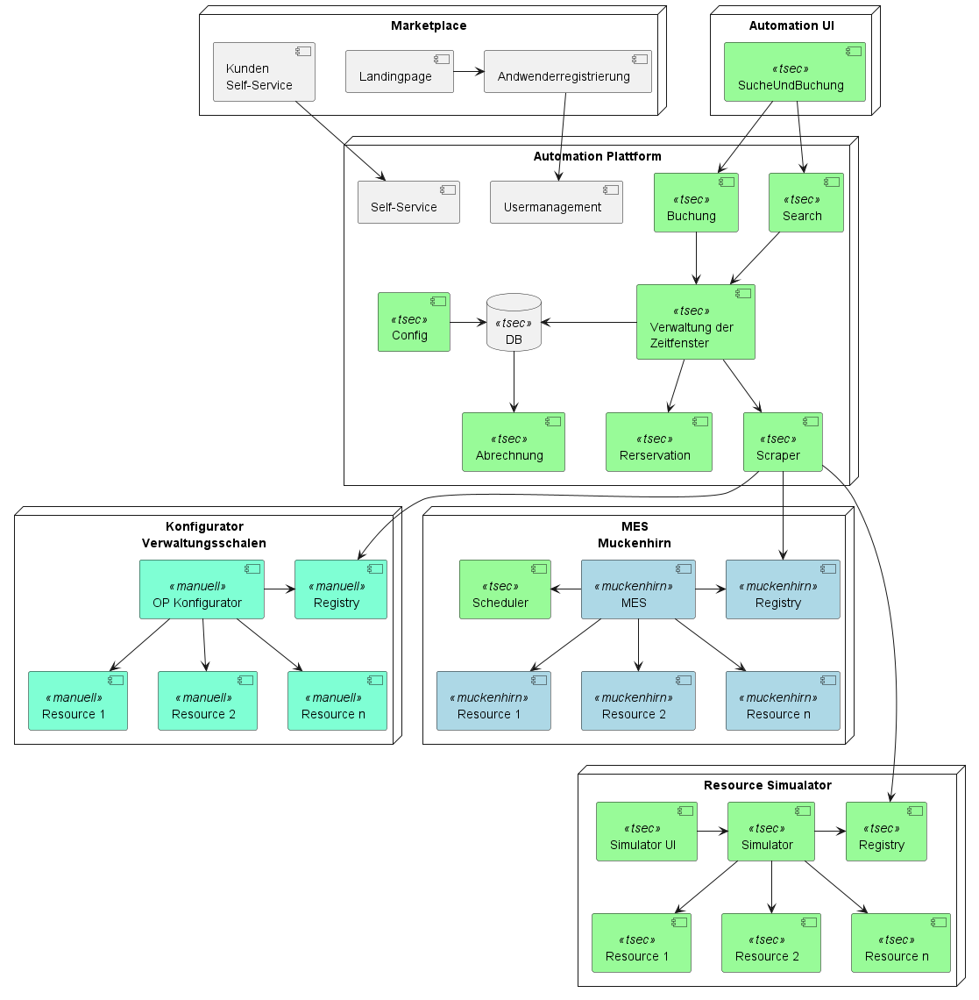

== Basys Swarm Demonstrator

Der Basys Swarm Demonstrator unterstützt die Prozesse zur Bereitstellung und Nutzung freier Produktionskapazitäten
zwischen verschiedenen Usern. Dieses Dokument geht von den Uranwendungsfällen aus: Der Nutzung und der Bereitstellung
von Kapazitäten. Von dort aus geht es auf die abgeleiteten Anwendungsfälle wie Firmenregistrierung und Bereitstellen
der entsprechenden Informationen.

=== Herangehensweise

Um möglichst früh einen laufenden Demonstrator zu erhalten werden Dinge zuerst die beiden Kern-Anwendungsfälle so
wie die von den Projektpartnern gemäß Ausschreibung benötigten Anwendungsfälle umgesetzt. Dies verschiebt zum Beispiel
die Discovery oder die Nutzerverwaltung in der Umsetzungsliste weit nach hinten, auch wenn sie technisch relevant ist. Dies dient dazu die Partner
nicht unnötig mit Demonstrator bezogenen Zielen zu belasten. Diese sind notwendig um dem Projektträger ein Gesamtbild
zu vermitteln, stehen aber hinter den, ebenfalls kommunizierten, wirtschaftlichen Zielen zurück.

=== Gezeigt im Demonstrator

Marketplace:: Marketplace mit Landingpage, Registrieren von Nutzern, manuelles Anbieten und Verwenden von Ressourcen

manuell:: Dynamisch instantiierte, kundenspezifische Verwaltungsschalen, die die Submodels zu Buchung und
Reservierung als Teil einer Vorlage bereitstellen.

muckenhirn:: MES mit Ressourcen die manuell und vollautomatisch gebucht werden können

trustsec:: Gesamtarchitektur und Plattform mit Schnittstellen zu den entsprechenden Partnern

=== Konzept

Die Plattform bietet Schnittstellen zu den verschiedenen Systemen, mit denen sie interagiert. Da die UI zwar
eine eigene Deploymentunit darstellt, fachlich aber eng mit der Platform verbunden ist, wird diese via
json over HTTP angesprochen,
es wird kein REST footnote:[https://en.wikipedia.org/wiki/Representational_state_transfer[REST] ist eine Resourcenorientierte Sicht], hier wird zur Transaktionssicherung eine servicezentrierte Sicht verwendet.

Mit den Fertigungssystemen kommuniziert die Plattform via Basys mit definierten SubModels und demonstriert
damit die Fähigkeiten von Basys.

Die Integration von Ressourcen und Plattform wird in als link:docs/README.adoc[Reservierungsmechamismus] beschrieben.

=== Weiterführende Links

* link:development.adoc[Entwicklungssetup] beschreibt wie die das Projekt technisch umgesetzt ist und die Entwicklungsugbenung aufzusetzen ist.
* link:src/main/java/de/trustsec/basys/demo/server/README.adoc[Plattform] beschreibt das vorläufige Domänenmodell der Platform

==== The Hidden Docs

* https://www.plattform-i40.de/IP/Redaktion/DE/Downloads/Publikation/Details_of_the_Asset_Administration_Shell_Part1_V3.pdf?__blob=publicationFile&v=10[Details of the Asset Administration Shell Part 1 V3]
** Typen: p98 ff
* https://www.plattform-i40.de/IP/Redaktion/DE/Downloads/Publikation/Details_of_the_Asset_Administration_Shell_Part_2_V1.pdf?__blob=publicationFile&v=8[Details of the Asset Administration Shell Part 2 V1]
* https://www.plattform-i40.de/IP/Redaktion/DE/Downloads/Publikation/Details_of_the_Asset_Administration_Shell_Part_2_V1.html[Details of the Asset Administration Shell Part 2 V1]
