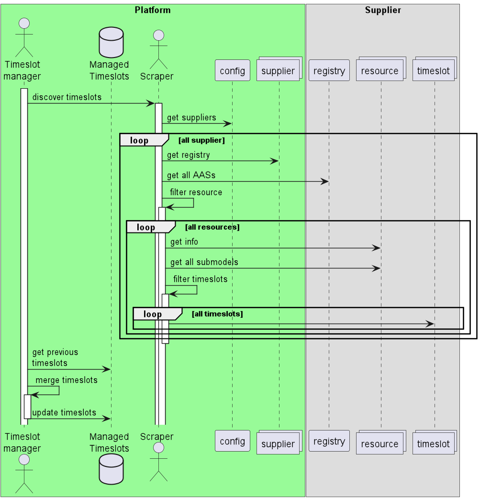
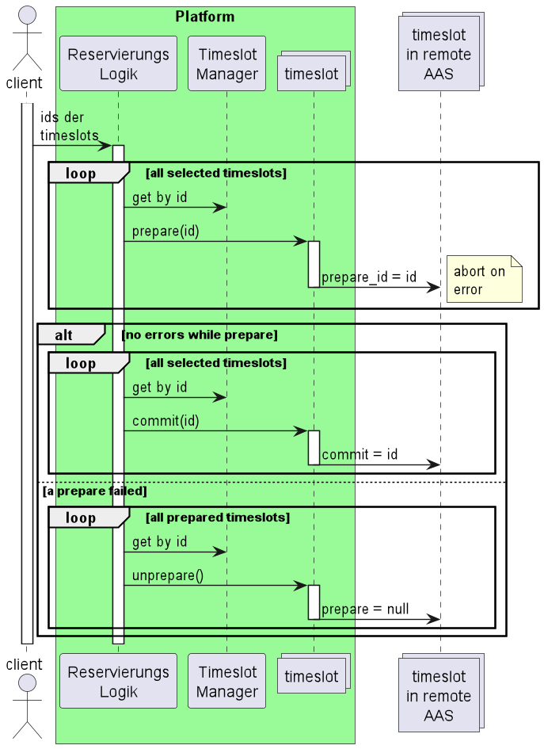
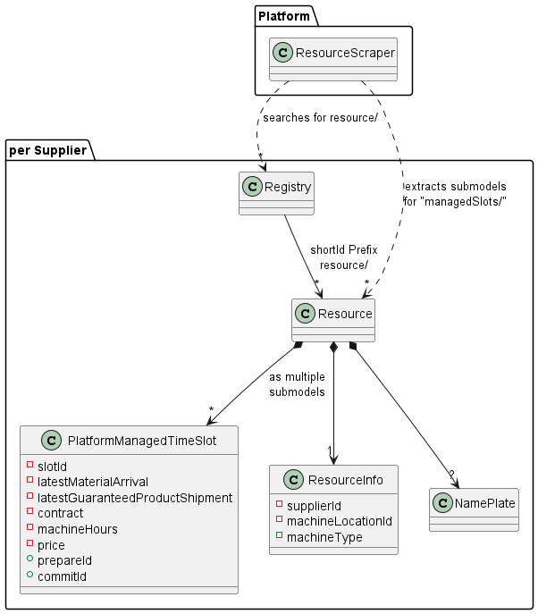

== Allgemeiner Ablauf

Nach dem Anlegen der Provider melden die Provider ihre AAS-Registry bei der Plattform an. Die Plattform
liest zyklisch die angebotenen Ressourcen so wie die durch die Plattform kontrollierten Zeitfenster aus.

Consumer
können nach für sie interessante Zeitfenster der Ressourcen suchen. Werden solche gefunden können eine oder mehrere
über die Platform reserviert werden. Sollte diese nicht möglich sein, meldet die Platform einen Fehler. Bei einer
Reservierungsanfrage führt die Plattform bei den gewünschten Ressourcen eine Vormerkung durch. Konnten alle Ressourcen
vorgemerkt werden, werden diese reserviert. Falls nicht, werden alle Vormerkungen zurückgenommen und die Reservierung
abgelehnt.

=== Registrierung

In der Automation-Demo sind die Provider und deren registry fest konfiguriert.

Dasselbe gilt für die Consumer und deren Passwörter.

=== Zeitfenster bereitstellen

Die Provider stellen ihre Ressourcen in Zeitfenstern zur Verfügung. Die Ressourcen werden durch Verwaltungsschalen
dargestellt. Die durch die Plattform verwalteten Zeitfenster werden durch eine beliebige Anzahl von Submodellen des Typs
`PlatformManagedTimeSlot` an der Ressource bereitgestellt. Es handelt sich explizit um _plattformverwaltete_ und
nicht um _verfügbare_ Zeitfenster. Sie bleiben präsent, auch wenn sie durch die Plattform reserviert wurden.

Damit die Ressourcen gefunden werden können, stellt jeder Provider eine Registry bereit, die alle verfügbaren
Ressourcen enthält. Die Plattform verwendet einen <<scraping,Scraper>> der das plattforminterne Abbild regelmässig
aktualisiert.

Die <<reservation,Reservierung>> erfolgt in einem two-phase-commit Verfahren. Für dieses werden zwei schreibbare Attribute im
SubModel angeboten: `prepareId` und `commitId`. Ist eines der Felder nicht `null` oder leer, darf es vom Provider
nicht mehr entfernt oder anderweitig angeboten werden.

Alle anderen Ressourcen und Zeitfenster dürfen durch den Provider beliebig entfernt werden. Sollen Inhalte eines
Zeitfensters geändert werden, wird dieses entfernt und ein neues Zeitfenster mit einer neuen ID angeboten. Dies
vermeidet eine vollständige Prüfung des Zeitfensters während der Reservierung.

=== Scraping [[scraping]]

Die Platform aktualisiert in regelmäßigen Abständen ihr internes Abbild der Ressourcen. Für jeden Provider
aktualisiert sie über dessen Registry die Liste der vom Provider angebotenen Ressourcen. Die einzelnen
Ressourcen werden durch Verwaltungsschalen dargestellt. Anschliessend werden von jeder Verwaltungsschale
die durch SubModels abgebildeten bereitgestellten Zeitfenster abgefragt.

=== Reservierung durchführen [[reservation]]

Empfängt die Plattform eine Reservierungsanfrage, führt sie bei allen angefragten Ressourcen eine Vormerkung durch.
Dazu wird im SubModel der entsprechenden Resource das Feld `prepareId` gesetzt. Konnten alle Zeitfenster reserviert
werden, wird bei allen die `reservationId` gesetzt. Die `prepareId` bleibt erhalten.

Ist ein Zeitfenster bereits vorgemerkt, werden alle bisher gemeldeten Vormerkungen gelöscht und die Reservierung
abgelehnt.

Sollte ein Zeitfenster doppelt angeboten worden sein, z.B. unter verschiedenen Verträgen, so wurde diese bereits
als reserviert markiert und kann nicht ein zweites Mal reserviert werden. Dasselbe gilt, wenn eine konkurrierende
Vormerkung oder Reservierung existiert.

Wurde das Zeitfenster oder die Ressource vom Provider gelöscht, kann das Zeitfenster nicht vorgemerkt werden. In
diesem Fall werden all bisher durchgeführten Vormerkungen dieser Reservierung gelöscht und die Reservierung
abgelehnt. (Wenn möglich sollte zeitnah ein erneutes Scraping dieser Ressource erfolgen)

Zeitfenster mit gesetzter prepareId oder reservationId dürfen vom Provider nicht mehr gelöscht werden.

=== Invarianten der Reservierung

* Ein Timeslot der einen Wert in `prepareId` hat, darf nicht entfernt werden und gilt als präpariert
* Ein Timeslot der einen Wert in `commitId` hat, darf nicht entfernt werden und gilt als bestätigt
* Eine Resource die einen präparierten Timeslot enthält darf nicht entfernt werden
* Eine Resource die einen bestätigten Timeslot enthält darf nicht entfernt werden
* Es wird garantiert das immer erst die `prepareId` und danach die `commitId` id gesetzt wird
* Es wird garantiert das immer, wenn eine `commitId` id gesetzt ist, auch die `preparedId` gesetzt ist
* Im Rahmen des Demonstrators wird garantiert das eine gesetzte `commitId` nicht mehr gelöscht wird.
* Eine Resource muss das Schreiben einer `prepareId` mit einem Fehler ablehnen, falls dies bereits gesetzt ist
** in der Demo liest die Reservierung zuerst den Wert. Ist der Wert bereits gesetzt, verhält sich die APP so, als würde das Schreiben durch den Timeslot abgelehnt. Dies vereinfacht die Logik in den Ressourcen des Demonstrators
